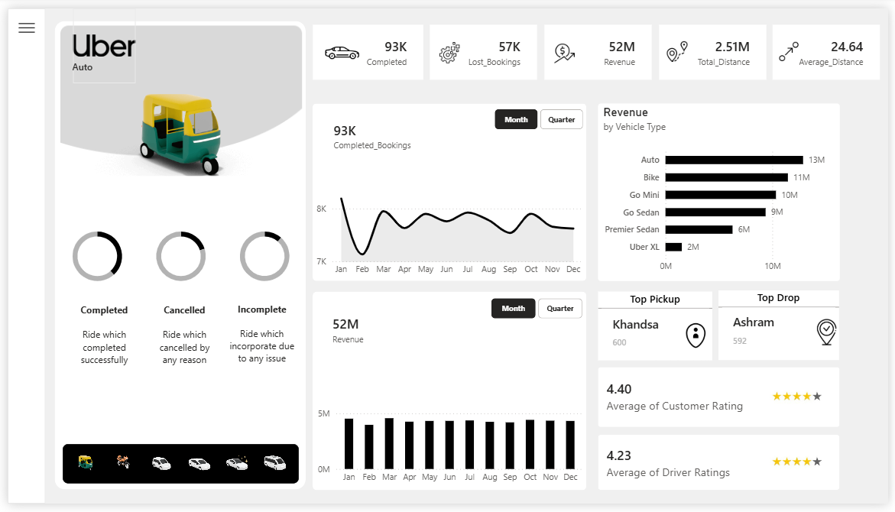

# 🚖 Uber Operations & Revenue Analytics Dashboard

An interactive, two-page Power BI dashboard designed to analyze ride completions, operational efficiency, cancellations, customer dynamic ratings, and revenue trends across different vehicle categories.

---

## 🖼️ Dashboard Preview

### 1. Landing Page (Home)

* **Purpose:** Minimalist landing interface providing smooth navigation to key overview dashboards (`Home` & `Overview`).

### 2. Operational Overview

* **Key Metrics:** Tracks 93K Completed Bookings, 57K Lost Bookings, 52M Total Revenue, 2.51M Total Distance, and 24.64 Average Ride Distance.
* **Vehicle Breakdown:** Highlights performance across Auto, Bike, Go Mini, Go Sedan, Premier Sedan, and Uber XL.
* **Location Analytics:** Identifies top pickup locations (e.g., *Khandsa*) and top drop locations (e.g., *Ashram*).
* **Quality Ratings:** Monitors Customer Rating (4.40 ★) and Driver Rating (4.23 ★).

---

## 🛠️ Features & Technical Implementation

* **Data Modeling & DAX:** Custom measures created for tracking completion rates, cancellation percentages, revenue per vehicle type, and monthly trajectory trends.
* **Dynamic Time Toggle:** Month/Quarter slicer options for tracking completed bookings and overall revenue trends.
* **Interactive Vehicle Filtering:** Custom icon navigation at the bottom allowing seamless filtering by specific vehicle modes (Auto, Bike, Cars, etc.).
* **Custom UI Design:** Modern, sleek 3D asset integration with custom card components and status doughnut charts (Completed, Cancelled, Incomplete).

---

## 💻 Tech Stack
* **Tool:** Power BI Desktop (`.pbip` project structure)
* **Language:** DAX (Data Analysis Expressions), M (Power Query)
* **Version Control:** Git & GitHub

---

## 🚀 How to Run Locally

1. **Clone the Repository:**
   ```bash
   git clone [https://github.com/your-username/uber-powerbi-dashboard.git](https://https://github.com/hitanshhhhhh/Uber_Dashboard.git)